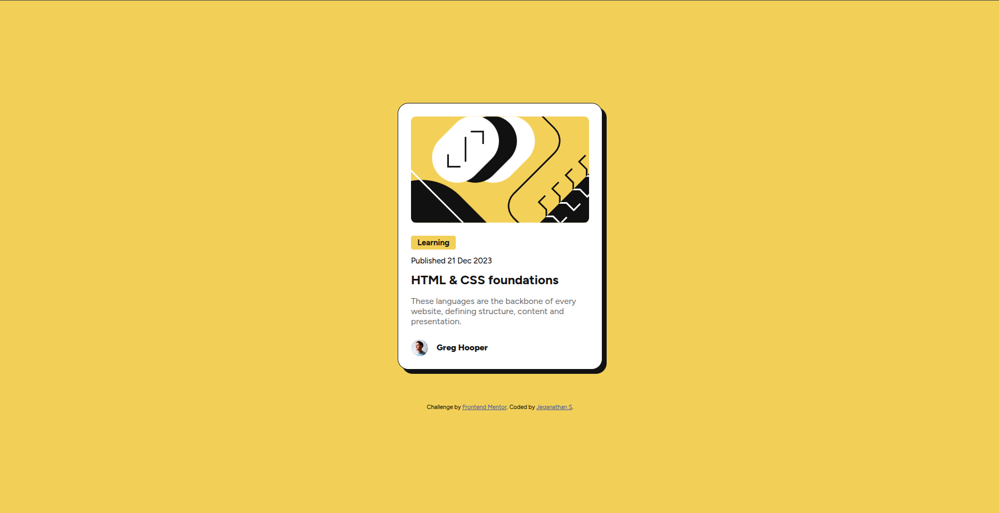

# Frontend Mentor - Blog Preview Card

This is my solution to the Blog Preview Card challenge on Frontend Mentor.

## 🔗 Links  
- Live Site URL: https://your-live-site-link  
- Solution URL: https://your-frontend-mentor-solution

## Screenshot  

## verview  
A simple blog preview card built using HTML and CSS.

## Built With  
- Semantic HTML  
- CSS  
- Flexbox  
- Mobile-first workflow

## 📚 What I Learned  
- How to structure a card component  
- How to center elements using flexbox  
- How to use margin, padding, border-radius, shadows, etc.

## 🚀 Continued Development  
I want to improve:
- Layout skills  
- Responsive design  
- Component structuring  

## 👤 Author  
- Frontend Mentor – @yourusername  
- GitHub – https://github.com/yourusername
